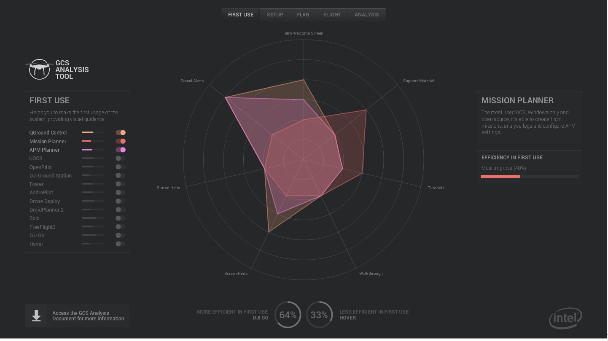

# Analysis

Some GCS interfaces already present good ideas about communicating to users crucial information concerning the operation of drones: incompatibility alerts, usage instructions or safety checkages, that prevent the user from flying with problems in the drone.

Some apps already show good initiatives about learning / support material. Most of them appear in mobile apps targeting basic drone users (consumers). 

Clear yet complete mission drawing tools are present mostly in mobile apps for use in autonomous missions, focusing video recording or mapping. 

There is one interesting approach to showing quick alerts about problems in drone systems that come from airplane interfaces.

Besides graphs, some apps have rerun mission features that are very interesting for representing visually the data collected during flights, and that makes it easier to perceive where and when problems occur.

Flight data UIs gather a lot of numeric data that (should) represent the attitude and performance of the drone, but the amount and the way in which data is presented sometimes may have the opposite effect.

Drone links can be configured in a couple of different ways, and some GCSs do not accept more than one type of connection. Having information about the link is crucial to do anything with the drone, but most interfaces do not present instructions or link the user to troubleshooting information about it.

Lack of feedback in configuring routines, vague instructions and application performance make it difficult for users to setup the drone without having to repeat the procedure a couple of times.

It occurs especially in applications that try to accomplish all the tasks required to run a mission. Generally they present mission planning tools with hard-to-use interfaces (place points by coordinates, complementary controls spread all over the screen , etc).