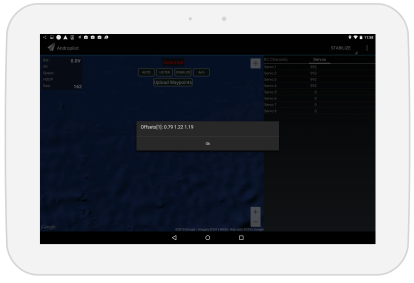
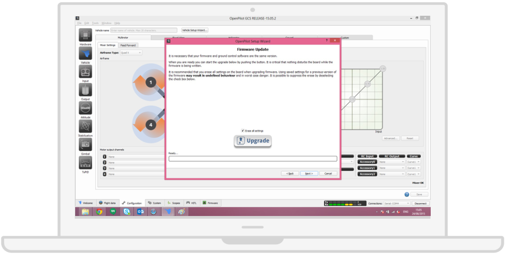

# Confusing Setup Tool

Lack of feedback in configuring routines, vague instructions and application performance make it difficult for users to setup the drone without having to repeat the procedure a couple of times.

###Andropilot

As an example, the accelerometer configuration displays a series of dialog boxes, each one containing one separate feedback about the configuration, making it really hard to apprehend the overall status of it. 

###OpenPilot

The setup panel provides information about what to care about when configuring the drone, but there is no information about compatibility with flight stacks and boards, and you keep trying to troubleshoot the operation until you find some external information that tells you something about it (OpenPilot is compatible only with its own flight stack).

