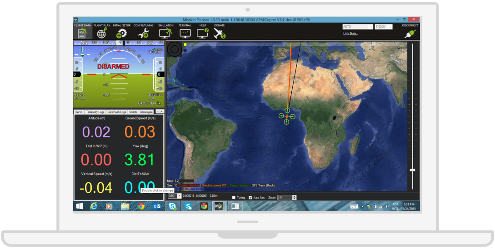
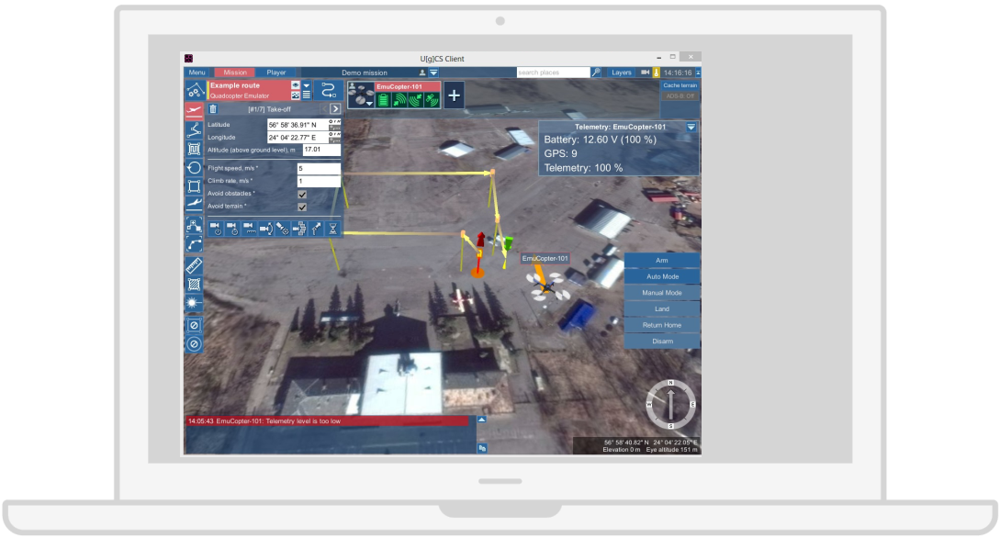

# Flight Data Overflow

Flight data UIs gather a lot of numeric data that (should) represent the attitude and performance of the drone, but the amount and the way in which data is presented sometimes may have the opposite effect.

### Mission Planner
Mission Planner’s flight data interface presents a lot of information distributed in controls and numeric values that could be translated into simpler visual tools that easily represent statuses, dangerous situations or drone attitude.

###UGCS

There are a lot of panels over the map, and the criteria for grouping the information is not very clear. It seems that there is valuable flight data information spread in different panels.

