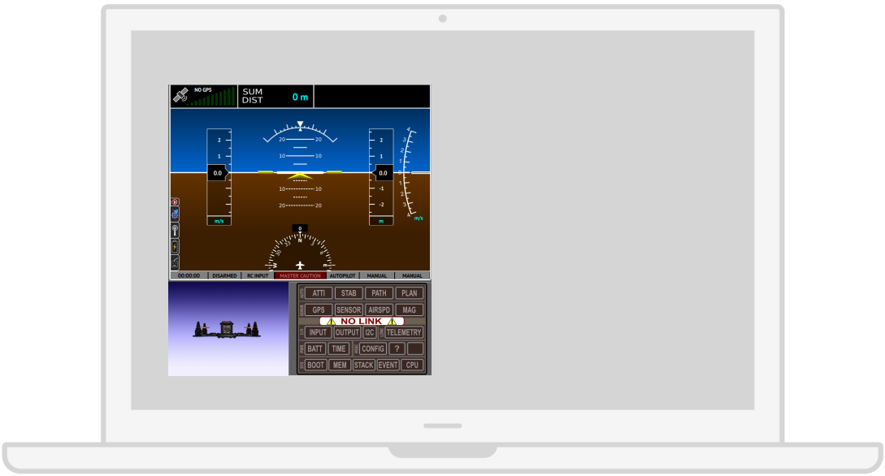

# In Flight Problem Alerts

There is one interesting approach to showing quick alerts about problems in drone systems
that come from airplane interfaces.

### OpenPilot

The lower right panel contains a series of alerts that are triggered whenever there is a problem with that system. In fact, this kind of information is quicker to perceive than values, because it cuts down the analysis part that would be done by the user. It’s a very common standard for alerts in airplanes. Also, there is an interesting 3D representation of the drone that reflects its attitude while flying.

