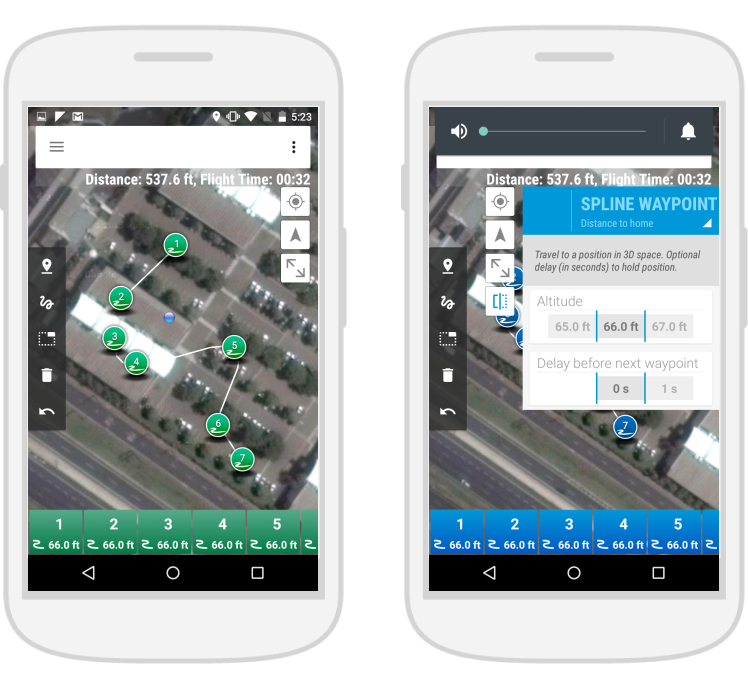

# Mission Drawing Tools

Clear yet complete mission drawing tools are present mostly in mobile apps for use in
autonomous missions, focusing video recording or mapping.

###Tower/DroidPlanner 2

Tower and DroidPlanner 2 have both a very similar mission planning tool.
Easy waypoint insertion by toggling the corresponding icon and clicking on the screen. The list below show all created waypoints in order, and waypoint action can be changed by clicking either on the pin or on the item in the list.

###UGCS

Disregarding the amount of panels over the map, this program has an interesting 3D mission planning tool, since this type of visualization makes it easier to understand the trajectory of the drone during the flight. Also, there are a lot of auxiliary drawing tools that can be relevant for this task (area measurement, elevation profile, etc).

