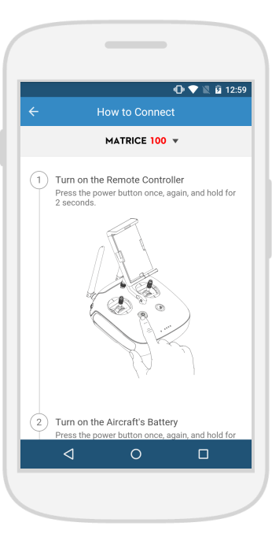

# Support Material

Some apps already show good initiatives about learning / support material. Most of them
appear in mobile apps targeting basic drone users (consumers).

###DJI Go
The app contains step-by-step instructions with images about drone connection.

###Solo

The app contains a small library with information on drone vocabulary. 

