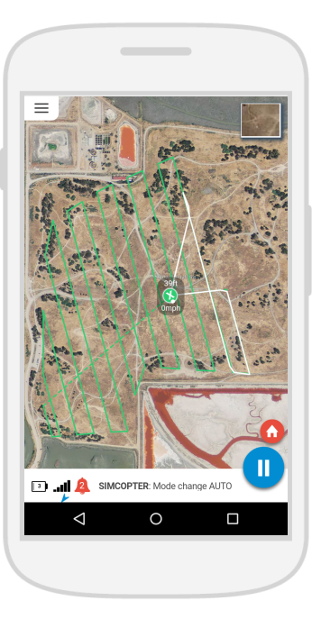
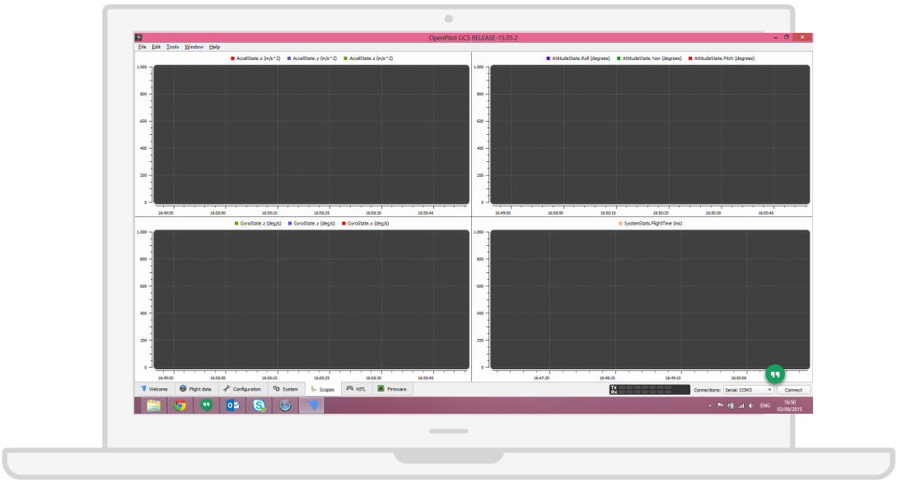

# Visual Tools for Flight Analysis

Besides graphs, some apps have rerun mission features that are very interesting for representing visually the data collected during flights, and that make it easier to perceive where and when problems occur.

###Droidplanner

Its mission player tool enables users to control mission progress by clicking a play/pause button, like a video player.
This feature has potential to be used to rerun missions for analysis purposes in conjunction with data from graphs, in order to help people absorb all the flight information in an easier way.

###OpenPilot

Openpilot’s log screen contains separate graphs for different drone parameters, which can be useful for comparing a lot of information about drone flights with not all data in the same graph.

